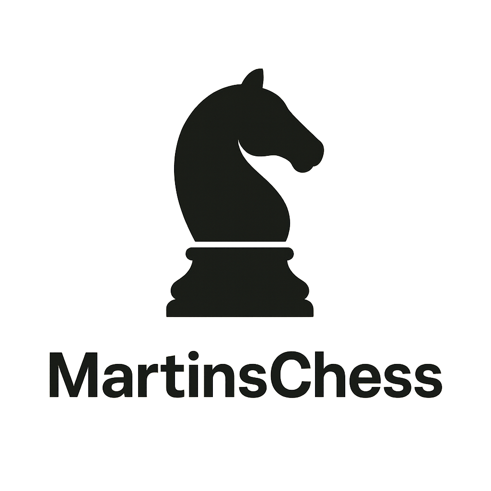

# MartinsChess

# ♟️ Projeto Xadrez – Humano x Máquina

<p align="center">
  
</p>

Este projeto é um **jogo de xadrez** desenvolvido em **Swift** utilizando **SwiftUI**, com foco na interação entre **humano x máquina**.  
A proposta é criar uma experiência fluida e intuitiva para dispositivos **iPhone**, explorando design moderno e desempenho eficiente.

Dominando o SwiftUI e a lógica do xadrez para criar um aplicativo de xadrez!

# Feature do xadrez

- Interface de usuário com tabuleiro de xadrez: domominar os layouts do SwiftUI, criar visualizações interativas de pecas e
  integrar prefeitanente gráficos personalizados de peças de xadrez.

- Implementar as regras do xadrez: codificar a lógica para os movimentos dos peões e todas as regras complexas que tornan tão elegrante.

- Desenvolver oponentes de IA: projetar oponentes de IA inteligentes usando algoritmo Minimax com poda alfa-beta, para que seu aplicativo possa
  possa desafiá-lo para um jogo inteligência.

- Detectar xeque-mate: desenvolver a lógica para identificar situações de xeque-mate e encerrar jogo com elegância, declarando um vencedor.

- Adicionar um toque de refinamento: aprimorar o aplicativo com histórico de movimentos, um console para informações do jogo e uma
  experiência de usuário fluida.

---

## 📌 Descrição

- **Modo de jogo:** Humano contra a máquina (IA integrada).
- **Plataforma:** Mobile (iOS – iPhone).
- **Interface:** Desenvolvida com **SwiftUI**, aproveitando o design declarativo da Apple.
- **Objetivo:** Estudo e prática de desenvolvimento iOS com um projeto divertido e desafiador.

---

## 🛠️ Tecnologias Utilizadas

- [Swift](https://developer.apple.com/swift/)
- [SwiftUI](https://developer.apple.com/xcode/swiftui/)
- [Xcode](https://developer.apple.com/xcode/)
- **iOS Simulator** (para testes)

## 📂 Estrutura sugerida do repositório

```TextPlain
MartinsChess/
│
├── assets/
│   ├── banner.png          # Imagem principal (banner do projeto)
│   └── screenshots/        # Prints do app rodando no iPhone
│
├── Sources/                # Código-fonte principal do projeto
│   └── XadrezApp.swift
│
├── Tests/                  # Testes unitários
│
├── README.md               # Documentação inicial do projeto
├── LICENSE                 # Arquivo de licença MIT
└── .gitignore              # Ignorar arquivos desnecessários no Git
```

## 📲 Como Executar o Projeto

1. **Clone o repositório:**
   ```bash
   git clone https://github.com/SilvaneiMartins/MartinsChess
   cd MartinsChess
   ```

## 📷 Assets

As imagens e recursos do projeto estão organizados na pasta assets.

---

## 📜 Licença

Este projeto está sob a licença MIT [./LICENSE].
Você pode usá-lo, modificá-lo e distribuí-lo livremente, desde que mantenha os créditos ao autor.

MIT License

---

## 👤 Desenvolvedor

- 💼 [LinkedIn](https://www.linkedin.com/in/silvanei-martins-a5412436)
- 🌐 [Site Pessoal](https://silvaneimartins.com.br/)
- 🐱 [GitHub](https://github.com/Store-Sam-Martins)
- 📧 silvaneimartins_rcc@hotmail.com
- 🎥 [YouTube](https://www.youtube.com/@silvaneimartins2487/featured)
- 🐦 [X (Twitter)](https://x.com/SilvaneiMartins)

---

🚀 Sinta-se à vontade para usar este projeto como base para os seus próprios apps.
